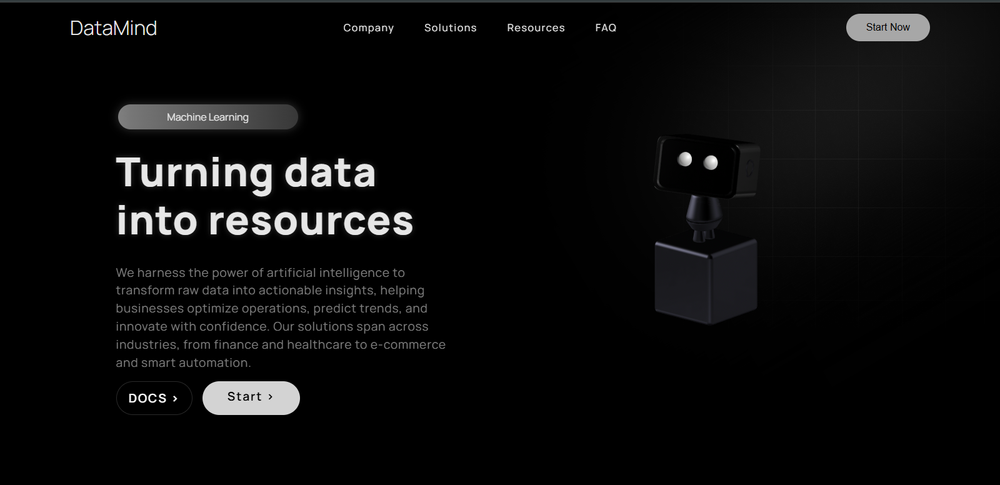

# Machine Learning Landing Page  

This project is a **modern and interactive landing page** for a **Machine Learning** company, designed to provide a **seamless and engaging user experience**. The page features **smooth fade animations** powered by the **AOS library**, enhancing the visual appeal as users scroll.  

## **✨ Key Feature: Interactive 3D Robot**  

A standout feature of this landing page is a **3D robot**, placed to the right of the main text. This robot follows the user's cursor, **looking in the direction of movement**, 
adding a dynamic and interactive element to the page. The **3D model was integrated using Spline**, ensuring a **high-quality, real-time animated effect**.  

## **🛠️ Technologies Used**  

The page is built with **HTML and CSS**, following **modern web design practices** to ensure **responsiveness** and adaptability across all screen sizes, from **desktops to 
mobile devices**.  

## **🚀 Main Features**  

- 🎨 **Smooth fade animations** with AOS  
- 🤖 **Interactive 3D robot** that follows the cursor  
- 🖥️ **3D model integrated** using Spline  
- 📱 **Clean and responsive** HTML & CSS design  
- 🌍 **Optimized for all devices**  

## **📷 Screenshots**  

 
